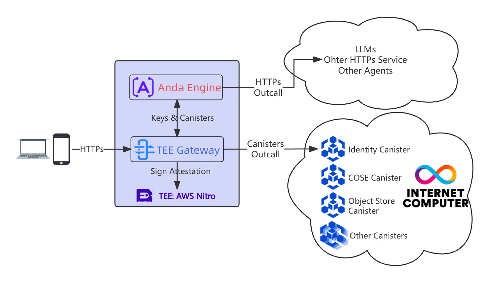
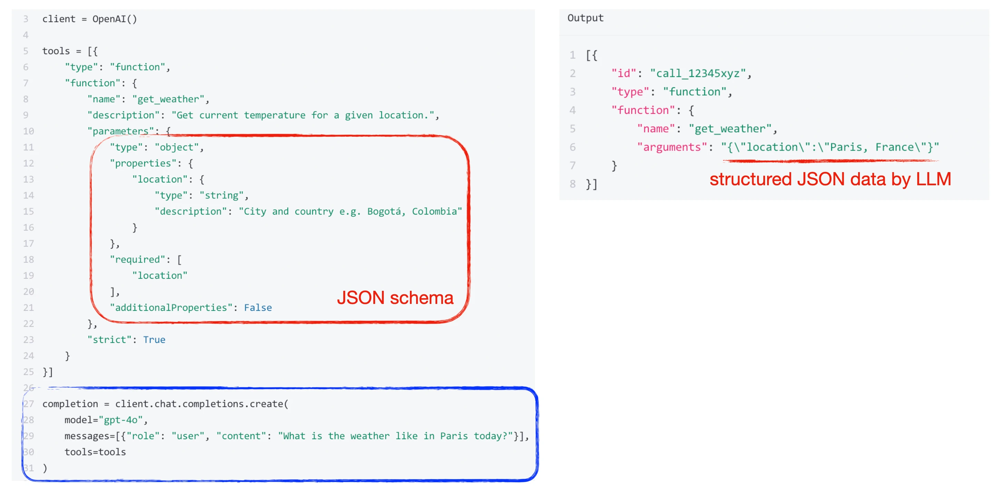
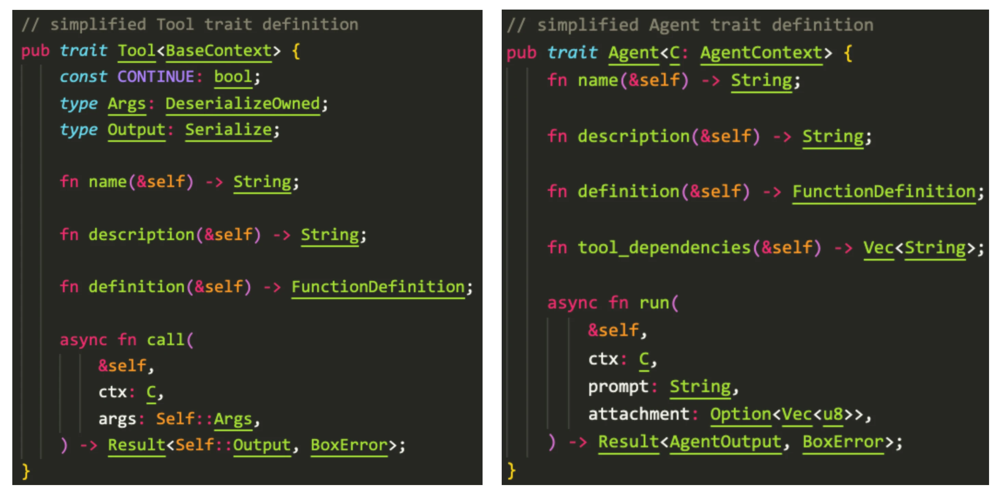
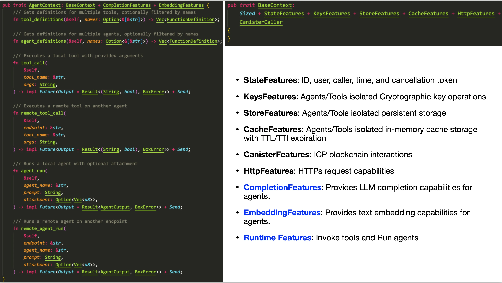

I am pleased to have the opportunity to introduce our AI Agent framework — Anda. I hope to clearly explain what an AI Agent is, its relationship with LLMs, what the Anda framework aims to achieve and how it does so, as well as how the ICP blockchain empowers AI Agents.

<!-- truncate -->

<iframe width="560" height="315" src="https://www.youtube.com/embed/J-b35nUc0lY?si=OU3pua2O6N5lv68k" title="YouTube video player" frameborder="0" allow="accelerometer; autoplay; clipboard-write; encrypted-media; gyroscope; picture-in-picture; web-share" referrerpolicy="strict-origin-when-cross-origin" allowfullscreen></iframe>

Currently, there are many AI Agent frameworks available in the market, developed by both large companies and small teams, numbering in the dozens or even hundreds. So why are we creating a new one?

These frameworks are primarily Python-based, similar yet each with its unique features. They mainly serve Web2 application scenarios. Even frameworks like Eliza, which support multiple blockchains, are essentially Web2 frameworks at their core.

We have developed this purely Web3 AI Agent framework using Rust. With it, we can create agents specialized in solving various domain-specific problems and tackle complex tasks by flexibly combining different agents. When a single agent cannot solve a problem independently, it can collaborate with other agents, forming a powerful problem-solving network. In short, we aim to build a highly composable, autonomous, and permanently memorizing AI agent network based on Anda.

## What is an AI Agent

**AI Applications** are more like "tools"; they can only perform specific tasks according to the rules or instructions you set. For example, a voice assistant can set alarms or check the weather for you, but it won't do anything proactively unless you ask.

**AI Agent** is a "smart employee" that can think and act on its own. It not only understands your requests but also figures out how to complete tasks on its own. It can even identify and solve problems proactively without being told. For instance, a true AI Agent can act like your personal assistant, proactively arranging your schedule, reminding you of important matters, and even making decisions based on your habits.

**Differences**:
- AI Applications are "passive"; they can only act on commands and lack autonomy.
- AI Agents are "active"; they can think, adapt to changes, and complete tasks independently.

Thus, **true AI Agents signify a paradigm shift from "tool intelligence" to "agent intelligence"**.

As agent intelligence, AI Agents can interact with each other without human involvement. We can imagine that in the near future, AI Agents will form their own networked society, eventually evolving into a super AGI system.

## Core Principles of AI Agent Frameworks

### LLM — The Intelligent Processor

Whether it's an AI application or an AI Agent, their intelligent core is the large language model, such as DeepSeek V3. The world knowledge of large models comes from training data, and the use of these models by people is called "inference". Inference is stateless, meaning each input is independent, with no memory. For example, if I tell it, "I am ICPanda, now 1 year old," and then ask, "How old is ICPanda?" it truly doesn't know. When you use an AI Chat application, the memory you feel it has is external, maintained by the application, not the AI model itself.

The inference of large models is essentially a read-only program running on GPUs; it doesn't remember new knowledge from your inputs nor can it communicate with the outside world. It is an intelligent processor, distinct from CPUs (Central Processing Units) and GPUs (Graphics Processing Units), processing unstructured data like natural language, images, and sounds.

When we talk about the powerful capabilities of AI, these capabilities do not directly come from the AI model itself but from the AI Agent. We can develop various AI Agents based on this intelligent processor.

The essence of an AI Agent is to infinitely expand the programming, perception, and action capabilities that large models lack. (Here, programming capability does not mean making the large model write a piece of code but digitizing the real world.)

For DeepSeek V3, its inputs and outputs are all text. How do we use it to accomplish various tasks? This is where the magic of **Function Calling** comes in.

### Function Calling — The Interface Between LLM and the External World

Function Calling is the interface for LLMs to interact with the external world, designed by the brilliant engineers at OpenAI.

Let's look at this example of a weather query using Function Calling.

In the blue box, besides the regular message text input to the large model, there is an additional tools array. The tools array contains a function named `get_weather`, along with a description telling the large model what the get_weather function can do, and a parameters parameter definition, which is a JSON Schema informing the large model about the parameter format of the `get_weather` function.

The LLM is now intelligent enough to determine from the user's request information whether to call the `get_weather` function. If it decides to call it, it will extract formatted JSON from the user's input according to the parameters format and return it to the client, i.e., the AI Agent. The AI Agent can then call the `get_weather` function with the formatted parameters and return the result to the large model, which then combines the result into natural language to return to the user.

We can see that through Function Calling, the large model can obtain the latest external information, although it does not remember this information. Through Function Calling, the large model can also indirectly execute external functions, such as setting alarms, buying tickets, or cryptocurrency transactions. Therefore, the large model is like a brain that temporarily cannot accept new knowledge, while the AI Agent is like a body, and Function Calling is the neuron that facilitates interaction between the brain and the body. The LLM brain interacts with the external world through the AI Agent body, and the capability range of the AI Agent determines the behavioral range of the LLM brain.

### Anda Core — Definition of AI Agent Types and Available Capabilities

Now we understand that developing an AI Agent revolves around the Function Calling interface, implementing various Functions, and combining them to complete tasks.

The Anda framework is designed to make it easier for developers to create AI Agents. Anda Core provides a standardized definition of AI Agent types and available capabilities, implements these types and capabilities in the Anda Engine, and also offers runtime management.

Let's look at the most core `Tool` type and `Agent` type in Anda Core. Both can be used by Function Calling, and developing an AI Agent involves implementing instances of these two types.

What's the difference between them? We see that the input and output of Tool are structured data, and it depends on a `BaseContext` state object. Developers do not need to worry about how Tool is called but must ensure that the structured data of inputs and outputs is concise and clear enough for the large model to process correctly. There is also a Continue constant on Tool, indicating whether to pass the Tool's output result to the LLM for further processing. The Agent type appears simpler; it accepts prompt text, and its output format is basically consistent with that of the large model. The Agent type can also define the tools it depends on. The Anda Engine checks tool dependencies at startup. The Agent type relies on an `AgentContext` state object at runtime.

The context object is a collection of functionalities provided by the Anda framework that Tools and Agents can use at runtime. Developers can create various Tools and Agents based on these functionalities. Let's first look at the `BaseContext` on the right, which is available to Tools. Its feature set includes:

- **StateFeatures**: ID, User, caller, time, and cancellation token
- **KeysFeatures**: Agents/Tools isolated Cryptographic key operations
- **StoreFeatures**: Agents/Tools isolated persistent storage
- **CacheFeatures**: Agents/Tools isolated in-memory cache storage with TTL/TTI expiration
- **CanisterFeatures**: ICP blockchain interactions
- **HttpFeatures**: HTTPs request capabilities

Now, let's look at the `AgentContext` on the left, which is available to Agents. It includes the feature set of BaseContext and additionally:

- **CompletionFeatures**: LLM completion capabilities for Agents
- **EmbeddingFeatures**: Text embedding capabilities for Agents
- **Runtime Features**: Tool calling (tool_call, remote_tool_call, tool_definitions) and Agent running (agent_run, remote_agent_run, agent_definitions).

Note that Agents can call other Agents and Tools locally or remotely through AgentContext, either explicitly according to Agent programming logic or automatically according to the suggestions of large models!

From the feature set of Context, we can see that the Tool type is a pure Function; it cannot call the capabilities of large models nor other tools. The Agent type, however, is a complex Function; it can call the capabilities of large models, other tools, and agents, and can also call remote tools and agents. These tools and agents can be called explicitly or automatically suggested by the LLM large model. This is the foundation for AI Agents to combine and collaborate, forming an intelligent agent network.

### Anda Engine — Runtime and Management of AI Agents

The Anda Engine is the complete implementation of Anda Core and the core scheduling engine of Anda. An Anda agent can contain multiple agents and tools internally, which are registered with the Engine and can be automatically scheduled and executed by the Engine.

When we want to add core functionalities to the Anda framework, we generally implement them in the Anda Engine, such as adding new, general-purpose Agents or Tools.

## How the ICP Blockchain Empowers AI Agents

- ICP provides AI Agents with decentralized, verifiable social identities, enabling trusted interactions with the external world. ([IC-COSE](https://github.com/ldclabs/ic-cose), [IC-TEE](https://github.com/ldclabs/ic-tee))
- ICP offers AI Agents a secure key derivation mechanism, safeguarding their privacy through encryption while empowering them with advanced cryptographic capabilities. (IC-COSE, IC-TEE)
- ICP supplies AI Agents with decentralized, permanent state storage, ensuring their perpetual existence. (IC-COSE, [anda_lancedb](https://github.com/ldclabs/anda/tree/main/anda_lancedb))

Earlier, we mentioned that the key difference between AI Agents and AI applications is that AI Agents are entities with autonomy, so they must have their own identity IDs. For Anda, the identity ID of an AI Agent is a decentralized trusted identity ID granted by the ICP blockchain, which is the ID field on the Context. This ID is the identity of the Anda Engine, and thus the identity of this Anda agent. When the agents and tools inside the Anda agent call the canisters of the ICP blockchain, they will use this ID to sign. They also use this ID to sign when making HTTPS calls to other internet services. Web2 services can verify the authenticity of this ID through the identity verification mechanism of the ICP blockchain. We have already provided a Rust library for Web2 services to use.

As a Web3 AI Agent, besides a trusted identity ID, another key feature is security and privacy, as well as encryption capabilities. Web2-style AI Agents might configure keys through configuration files, with the keys actually generated and held by developers. Anda, however, generates root keys through the decentralized key derivation mechanism of the ICP blockchain, which is an absolutely secure way of key generation; even AI Agent developers cannot obtain this key. With this absolutely secure root key, developers can implement various encryption functions, such as interfacing with other blockchains or even issuing TLS certificates. It is possible to develop a certificate-issuing AI Agent using the Anda framework, with ICP and TEE ensuring its authenticity and security. The biggest challenge is whether it can pass audits and certifications by organizations like WebTrust.

The StoreFeatures of the Anda framework are based on the `ObjectStore` protocol, maintained by the Apache Arrow project, which is a universal data storage protocol. Its backend can interface with many storage services, such as AWS S3, Azure Blob Storage, Google Cloud Storage, local files, memory, etc. We use the lancedb vector database to implement the knowledge memory of AI Agents, and its backend is also ObjectStore protocol storage. Therefore, we have implemented the ObjectStore protocol in the IC-COSE project and also support encryption, allowing knowledge memories to be encrypted and permanently stored on the ICP blockchain. I know there are some implementations of vector databases on ICP, but they are not suitable for encryption scenarios.

## How AI Agents Run in TEE

TEE computing provides Anda with a hardware-level secure isolated computing environment and identity proof.

Currently, the Anda framework supports AWS Nitro enclave through IC-TEE, and will support Intel SGX, NVIDIA's TEE GPU, etc., in the future. Only by running in TEE can we trust and verify that Anda is still Anda, that it has not been tampered with, and that its computing state (such as keys) is in a secure environment and cannot be stolen. For example, I can make the current AndaICP enclave image public, and anyone can run it, but no one can steal the keys inside. However, even if multiple instances are running simultaneously, there will only be one AndaICP, so there is no need to run multiple instances.

An interesting feature here is that with the support of ICP and TEE technologies, I can make a program image containing confidential information public for others to run together, without worrying about the leakage of confidential information, which was impossible to achieve before. Since we can run AI Agents in TEE, we can also run other programs, such as border gateways or TEE-based decentralized exchanges.

In the technical documentation of the anda project, there is a sequence diagram showing the startup process of Anda in TEE, which we will not detail here.

https://github.com/ldclabs/anda/blob/main/docs/architecture_cn.md

## The Development Roadmap of Anda

Finally, let's introduce the development roadmap of Anda:
- Supports non-TEE environments, suitable for Web2 use cases.
- Anda website and documentation.
- Integrate more blockchains (SOL, ETH, BTC, DOGE, etc.) to enable AI Agents for more real-world applications.
- Launch developer grant program and ecosystem fund.
- Anda AI Agents cloud service (AI agents Network).

Although the Anda framework was born from Web3, it can also adapt to Web2 usage scenarios, and we will support non-TEE environments. However, we can retain the identity and key derivation mechanisms of ICP, hoping to use this opportunity to bring ICP into Web2 scenarios.

We will develop an Anda website to provide more documentation and tutorials, making it easier for users to understand Anda and for developers to better use the Anda framework.

We will also integrate more blockchains, such as SOL, ETH, BTC, DOGE, etc., and develop more AI Agents based on real-world application scenarios.

We will launch a developer grant program and an ecosystem fund, hoping to attract more developers to join the Anda ecosystem.

Finally, we will develop Anda AI Agents cloud services and gradually evolve them into an intelligent agent network.
